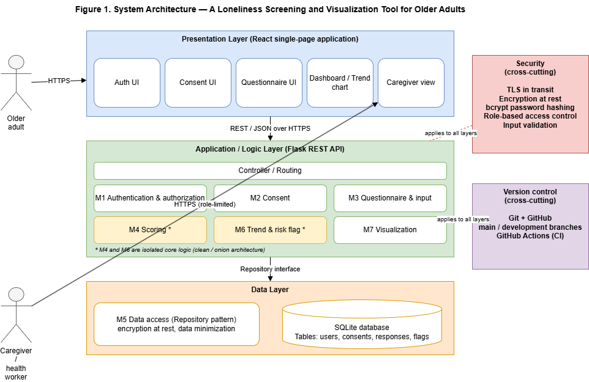
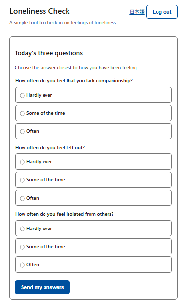
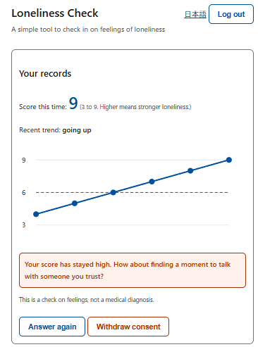
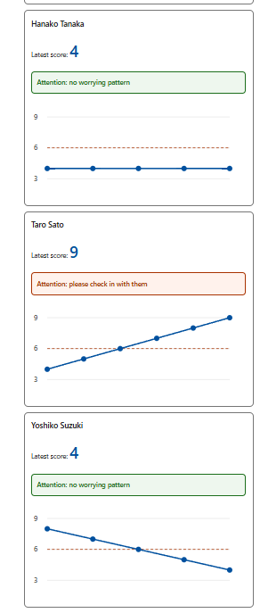
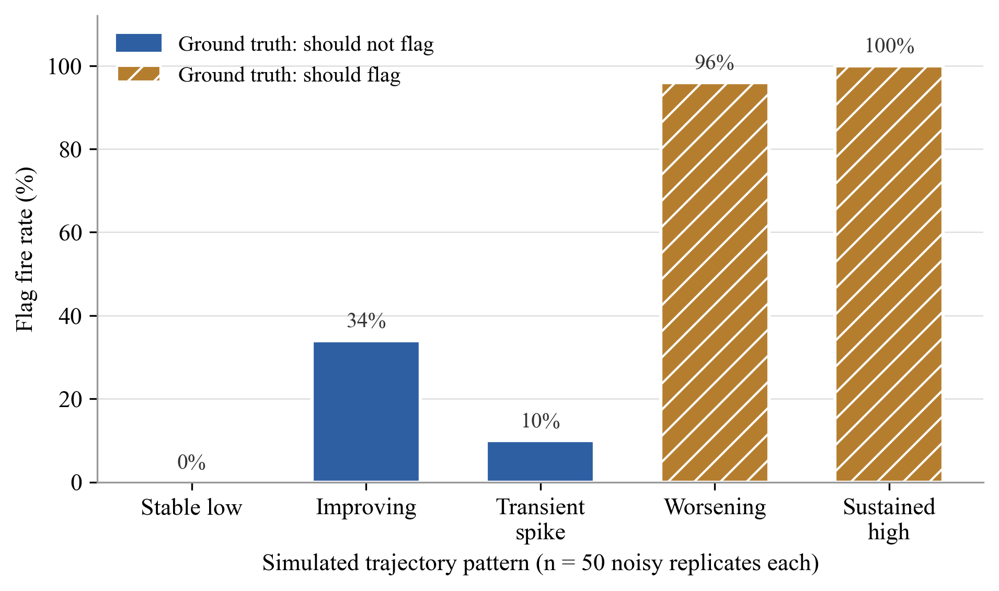

# A Loneliness Screening and Visualization Tool for Older Adults

**Shigekazu Ukawa** · MSIT Capstone Project, University of the People · 2026

A web application that lets an older adult answer the validated Three-Item
Loneliness Scale in under a minute, tracks the score over time, and alerts an
authorized caregiver **only when the pattern is sustained or worsening** — a
single high score never raises an alarm, because loneliness fluctuates and
one-off spikes may be transient.

The tool screens; a clinician diagnoses. All results below come from simulated
data, and no real personal information was used at any stage.

[**View the source on GitHub**](https://github.com/shigekazu23-star/loneliness-screening-tool) ·
[Releases](https://github.com/shigekazu23-star/loneliness-screening-tool/releases) ·
[Setup and configuration guide](CONFIGURATION.md)

---

## Why this project

Research on internet use and loneliness in older adults reports a small
average association with very large variation between individuals — the
strongest signals appear among the loneliest and least healthy. A uniform
digital intervention is therefore unlikely to reach the people who need help
most. This project takes the complementary path: **measure the outcome itself,
repeatedly, and direct human attention to the people whose loneliness stays
high or keeps rising.**

## What was built

| Layer | Technology | Design decision |
|---|---|---|
| Presentation | React (Vite), Japanese-first UI with externalized strings | Large type (20 px base), 56 px touch targets, one action per screen |
| Application | Flask REST API, seven modules (auth, consent, validation, scoring, repository, trend/flag, visualization) | Scoring and flag logic isolated from framework and database — pure, testable functions |
| Data | SQLite behind a repository interface | Data minimization: only what the trend and the flag require is stored |

Consent is explicit, versioned, and revocable; withdrawal removes a person
from the caregiver view on the very next read. Access is separated by role, so
the older adult controls what is shared.

## How well it works

Every number below can be regenerated from the repository: the measurement
scripts, the fixed random seed, and the tagged baselines ship with the code.

| Measure | Result |
|---|---|
| Risk-flag sensitivity (250 simulated trajectories, fixed seed) | **0.980** |
| Risk-flag specificity | **0.853** |
| Isolated single spikes suppressed | 9 of 10 replicates |
| API latency, submit path (p95, local measurement) | **33 ms** |
| WCAG 2.1 contrast, all eight tested color pairs | **AA or better** (6 of 8 AAA) |
| Automated tests (unit / integration / browser E2E) | **36 passing** (19 / 9 / 8) |
| Statement coverage, screening core | **100 %** |

The unfavorable numbers are reported alongside the favorable ones: 34 % of
*improving* trajectories still raised an early alert, which identifies the
next calibration target rather than being hidden.

## Engineering practices

- **Testing pyramid** — 19 unit tests including paired boundary cases at both
  decision thresholds, 9 integration tests against a real disposable database,
  and 8 browser-driven end-to-end scenarios written in given-when-then form,
  each tied to the requirement it verifies.
- **The E2E suite earned its keep** — it caught a WCAG 2.1 Label-in-Name
  violation (a speech-input user could not activate the language toggle by
  saying its visible label) that a structured manual inspection of the same
  control had missed. Found, fixed, retested.
- **Mutation-style fault injection** — deliberately raising the screening
  cutoff makes three tests fail, evidence that the suite detects meaningful
  regressions rather than merely executing code.
- **Disciplined delivery** — protected main branch, pull requests gated by CI
  (28 fast tests plus a production frontend build), semantic version tags with
  generated release notes, and a configuration guide that lets a clean machine
  reproduce the system.

## Honest limitations

Classification metrics come from simulated trajectories and developer-defined
ground truth; they show the implementation behaves as specified, not clinical
validity. The score cutoff has not been calibrated in the intended Japanese
community-dwelling population, and usability was verified by structured
inspection rather than by testing with older adults. Transport encryption and
encryption at rest are documented prerequisites for any deployment with real
data, not yet implemented in the prototype. These limits are stated in the
project report and drive the future-work plan.

---

*Built as the capstone for the Master of Science in Information Technology,
University of the People. Contact: [GitHub profile](https://github.com/shigekazu23-star).*
